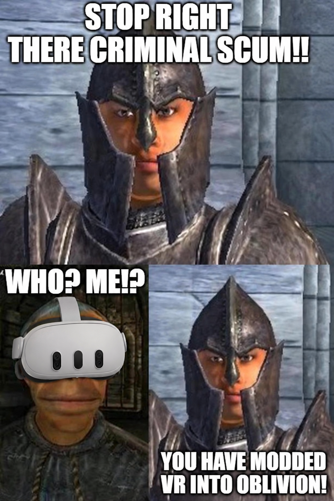

# OBVR - TES4 Oblivion (2006) in VR



Play the original **The Elder Scrolls IV: Oblivion** in real VR. Real 3D, head
tracking, your menus and HUD in the headset. (Not for the Remastered edition.)

**Status: early test build (0.2.x).** Sit down, grab your mouse, keyboard or
gamepad and you're in Cyrodiil - that part works and is what this release is for.
Playing standing with motion controllers is being built right now and is still
switched off.

**Join the Discord:** https://discord.com/channels/747967102895390741/1547539304786436228 -
questions, bug reports, screenshots, or just to say hi.

## What you get

- **Real 3D.** Each eye gets its own picture, so the world has depth.
- **Head tracking.** Look around and lean in, the camera follows your head.
  You still walk with mouse/keyboard or gamepad.
- **Aim with your head.** Bows, spells and swords go where you look, in first and
  third person. Walking stays independent of where you look.
- **One clean crosshair** that sits at the distance of what you're aiming at.
- **HUD, menus and dialogue in the headset.** Pause menus float in front of the
  world with Oblivion's own sepia look. Main menu, loading screens and videos
  play on a big cinema screen.
- **A welcome walkthrough and a settings menu** inside the headset (`Insert`).
- **Recenter** your view with the `Delete` key (`Entf` on German keyboards).
- **Comfort options** like smooth turning.
- Works with or without the 4GB patch, and with Mod Organizer 2.

## Coming next: standing with motion controllers

The big one. Swords in your hand, swings that actually hit, block with your shield,
grab and throw things, hold a two-hander with both hands, shove people, lead NPCs by
the hand, your HUD on your hands, and more. A lot of it is already built and being
tested. It is **not ready yet** and stays off - the welcome walkthrough shows it
but won't let you pick it. If you're brave, `[Hands] Enabled=1` in `OBVR.ini`
turns it on anyway. Please say so if you report a bug from it.

## Known issues

- The recenter key does nothing during the intro videos. It works from the main
  menu on.
- Typing text (like your character's name) still needs the keyboard.
- Oblivion Reloaded, ORC, E3 and Enhanced Camera don't work together with OBVR.
  See [Compatibility](#compatibility).

## What you need

- Oblivion **1.2.0.416** (32-bit). **Steam version tested**; GOG and disc with the
  last patch should work but are untested.
- [xOBSE](https://github.com/llde/xOBSE/releases/latest) 22.13 or newer.
- [MenuQue v16b](https://www.nexusmods.com/oblivion/mods/32200), for the
  in-headset menus. Without it you get simpler fallback menus, VR still works.
- [DXVK](https://github.com/doitsujin/dxvk/releases/latest). Not optional.
- **SteamVR** and a headset it runs. Meta headsets (Quest via Link, Air Link,
  Virtual Desktop or Steam Link, Rift) work like any other SteamVR game.
- Windows 10 or 11.

Tested so far on one setup: Dream Air headset, Valve Index controllers, RTX 4090,
Windows 11. Everything else is exactly what your reports are for.

## Installing

1. **xOBSE:** put `obse_1_2_416.dll`, `obse_editor_1_2.dll`,
   `obse_steam_loader.dll`, `obse_loader.exe` and its `Data` folder into your
   Oblivion folder.
2. **DXVK:** from the archive's `x32` folder, copy only `d3d9.dll` next to
   `Oblivion.exe`.
3. **OBVR:** download `OBVR-<version>.zip` from
   **[Releases](https://github.com/Naragorn/OBVR/releases)** and extract it into
   Oblivion's `Data` folder.
4. **MenuQue v16b:** merge its `Data` folder into Oblivion's (or install it as its
   own mod in MO2).
5. **Only for 0.2.1 and older:** copy the **32-bit** `openvr_api.dll` from
   `Steam\steamapps\common\SteamVR\bin\win32\` into `Data/OBSE/Plugins/`, next to
   `OBVR.dll`. Newer versions bring it along.
6. **Turn off the Steam Overlay for Oblivion.** In your Steam Library, right-click
   **Oblivion > Properties > General** and switch the overlay off. This is required.
7. Start SteamVR, then start the game with **`obse_loader.exe`** in your Oblivion
   folder - not with Steam's Play button.

**Tip - start it from the VR library:** in Steam, **Games > Add a Non-Steam Game to
My Library...**, pick `obse_loader.exe` from your Oblivion folder. Now it shows up in
your library and you can start it right from SteamVR's game list, headset on.

**Mod Organizer 2:** just install the OBVR zip as a normal mod. OBVR itself doesn't
need Root Builder (xOBSE's own files in the game folder do).

**Uninstalling:** delete `OBVR.dll`, `OBVR.ini`, `OBVR-LICENSE.txt`,
`OBVR-crosshair.cache`, `openvr_api.dll`, `openvr_api-LICENSE.txt` and the
`OBVR_Input` folder from `Data/OBSE/Plugins/`, plus `OBVR_Onboarding.xml` and
`OBVR_Settings.xml` from `Data/Menus/Generic/` and the `Data/Menus/Prefabs/OBVR/`
folder. OBVR doesn't touch your saves. Want to rule OBVR out quickly? Set
`[Camera] HookEnabled=0` in `OBVR.ini`.

## Settings

Press `Insert` in the game for the settings menu. Everything else lives in
`OBVR.ini` (in `Data/OBSE/Plugins/`), each option explained right above it. Changes
apply while the game runs, no restart needed.

A few worth knowing:

| Setting | What it does |
| --- | --- |
| `[Render] Stereo` | `dual` real 3D (default), `aer` lighter fallback, `none` flat |
| `[Render] EyeSeparationScale` | depth boost: above `1.0` the world feels deeper and a bit smaller. Stay below ~1.5 |
| `[Render] Menus` | `world` menus float in front of you, `cinema` on a flat screen |
| `[Head] RecenterKey` | the recenter key, `Delete` (`Entf`) by default |
| `[Look] *` | turning, aiming and comfort options |
| `[Hands] Enabled` | standing with motion controllers - not ready yet, off |

## Found a bug?

Tell us on [Discord](https://discord.com/channels/747967102895390741/1547539304786436228)
or open an issue on the **Issues** tab here. Please include:

- **`OBVR.log` and `OBVR.log.prev`** from your Oblivion folder. Without them we
  can rarely fix anything. (They contain your install path, nothing else personal.)
- What you did and what you saw.
- Your headset, graphics card, and other mods you use - other mods are the most
  common cause of trouble.
- If the game froze instead of crashing: did the monitor still move? Did SteamVR
  still track?

## Compatibility

- **Oblivion Reloaded, Oblivion Reloaded Combined, E3:** don't work with OBVR. They
  change the same parts of the game OBVR needs. Pick one.
- **Enhanced Camera:** doesn't work with OBVR. The game runs flat while it's
  installed; remove `OBSE_EnhancedCamera.dll` to play in VR.
- **NorthernUI:** works (tested with 2.0.3).
- **ENB:** not tested.
- Other mods that don't change graphics or the camera should be fine. Tell us either
  way!

## For modders and developers

The deep dive lives in the repo:

- `HANDOFF.md` - how OBVR works inside, and every dead end on the way.
- `docs/` - the specs for every feature, including the standing mode.
- `docs/vr-modding/` - a knowledge base for bringing flat games into VR.

**Building:** Oblivion is 32-bit, so build 32-bit, with Visual Studio 2022 Build Tools:

```
cmake -B build -G Ninja -DCMAKE_BUILD_TYPE=Release .
cmake --build build
```

**Tests** are their own project; build them 32-bit too:

```
cmake -B build-tests tests -G Ninja -DCMAKE_BUILD_TYPE=Release
cmake --build build-tests
ctest --test-dir build-tests --output-on-failure
```

`tools/package-release.ps1` builds the release zip. Pull requests are welcome;
two house rules: every game address needs two independent sources, and fixes go
after the cause, not the symptom. Everything in the repo is in English.

## Supporting the work

OBVR is free and stays free. If it gets you into Cyrodiil and you want to buy a
coffee for the evenings it took: https://www.patreon.com/naragorn

Patrons get new builds of this and future VR mods early, with testing notes, and on
higher tiers a vote on which game gets the VR treatment next. Every build still
lands here - early access is a head start, not a lock.

Crypto tips are welcome too:

| Coin | Address |
| --- | --- |
| BTC | `bc1q78akvct56ctrgcz0ahzthm3sjayu96tl8fdhc4` |
| ETH (Ethereum network) | `0x94c3Ec9707a1ac383F40Bb55Bff63d37175AC666` |
| SOL | `5GYdnxLnKByKuptpHtqkcmCx8LTjaMm5BtkoFN4jvCEU` |

## License

**GNU General Public License v3** (`LICENSE`). Copyright (C) 2026 Naragorn.

In short: use it, change it, share it, build on it. If you pass it on, pass the
source on with it under the same license. No closed or paid-for versions. The
license text is what counts; this is just the summary.

`src/obse/PluginInterface.h` copies the layout of two structs from xOBSE's
`PluginAPI.h` so the plugin can load, like every OBSE plugin does.

## Thanks to

- [xOBSE](https://github.com/llde/xOBSE) - the plugin loader.
- [OpenVR](https://github.com/ValveSoftware/openvr) - the VR runtime.
- [DXVK](https://github.com/doitsujin/dxvk) - Direct3D 9 on Vulkan.
- [NorthernUI](https://github.com/DavidJCobb/NorthernUI) and
  [TESReloaded](https://github.com/llde/TESReloaded) - reverse-engineering references.
- [openRBRVR](https://github.com/Detegr/openRBRVR) - the closest relative, another
  32-bit game brought into VR.
