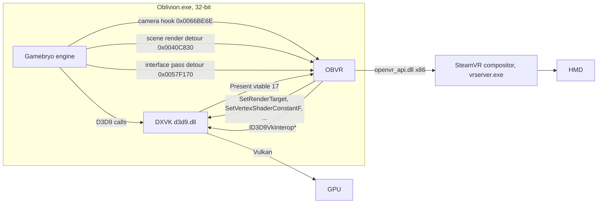
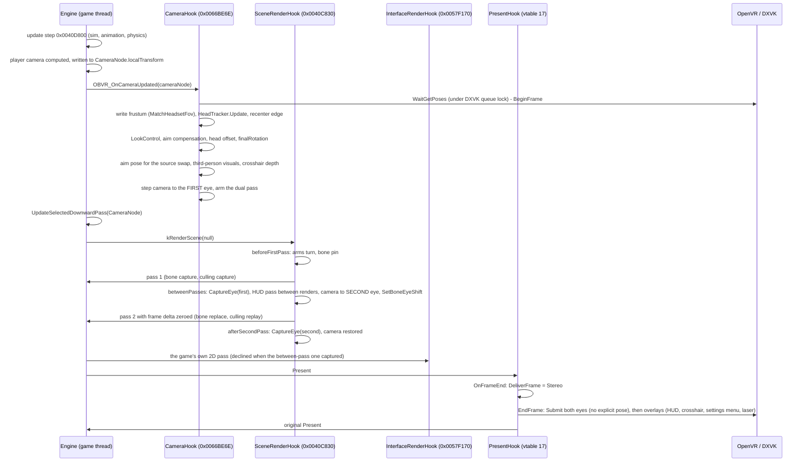

# OBVR architecture, as built

Status of this document: describes the code at commit `43f619c` (0.1.1, 2026-09-05).
Everything here was read from the source; where a comment claims something the code does
not do, the discrepancy is called out.

## What OBVR is

`Scope: Oblivion`

A 32-bit DLL loaded by xOBSE into `Oblivion.exe` 1.2.0.416. It patches five engine sites
and a handful of Direct3D 9 method-table entries, reads the headset through OpenVR
(`openvr_api.dll`, loaded at runtime), and hands the game's own frames to the SteamVR
compositor as Vulkan images obtained through DXVK's D3D9 interop interfaces. There is no
second process, no OpenXR path, no engine rewrite.

**Guiding idea:** *Oblivion stays Oblivion.* The game's own camera and render pipeline are
kept and augmented; nothing is reimplemented. The VR camera is the vanilla camera
composed with the tracked head pose, rendered once per eye.

## Stereo model in one sentence

`CONFIRMED`, `Scope: Oblivion`

OBVR is **engine-hook geometry stereo, same-tick, sequential**: the engine's own
world-render function is called twice per game tick from a detour, with the camera node
stepped one eye baseline between the calls, and both finished images are submitted to the
compositor in the same frame. It is *not* native engine stereo (Gamebryo has no notion of
two eyes), *not* alternate-eye rendering (that exists as a fallback mode, `Stereo=aer`),
and *not* depth reconstruction. See [rendering-and-stereo.md](rendering-and-stereo.md) for
the taxonomy and the details.

## Why OpenVR and not OpenXR

`CONFIRMED` for the facts dated below, `Scope: General VR` (bitness) / `Scope: OpenVR`

Oblivion is a 32-bit process, so OBVR is a 32-bit DLL and needs a 32-bit VR runtime.

- `openvr_api.dll` has always shipped for x86 (`bin/win32/` in ValveSoftware/openvr), and
  OpenVR is out-of-process by design (vrclient in the game, vrserver.exe outside), so the
  64/32 bridge exists. Valve, on ValveSoftware/openvr issue #1687 (2022): "OpenVR supports
  32-bit applications. On the other hand, the OpenXR implementation in SteamVR does not
  support them, as opposed to most other vendors OpenXR runtimes."
- SteamVR added 32-bit OpenXR support in **beta 2.17.2 on 2026-06-11** ("Added support for
  32-bit OpenXR applications", https://steamcommunity.com/app/250820/announcements/). As of
  2026-09-05 the stable branch stood at 2.16 (2026-06-03) and the beta at 2.17.6
  (2026-07-21). Whether 32-bit OpenXR has reached a stable SteamVR release: `UNKNOWN`.
- Under Proton, `wineopenxr` is not built for i386 (Proton `Makefile.in`, per `HANDOFF.md`
  section 10); OpenXR drops out entirely there. `UNVERIFIED` against the 2026 Proton tree.
- A 64-bit helper process (the way DR-89/fear-vr and praydog/FEAR2VR do it) was rejected as
  oversized for OBVR's needs; see [ecosystem-and-prior-art.md](ecosystem-and-prior-art.md).

`TrackerSource` in `src/vr/HeadTracker.h` is an enumeration of interchangeable head
sources with an `OpenXR` entry that is declared and **not wired up** (`HeadTracker.cpp`
returns identity for it). Adding an OpenXR backend is a matter of a second backend behind
that enumeration plus a second texture path into the compositor; the camera code would not
change.

## Process, loading, dependencies

`CONFIRMED`, `Scope: Oblivion` / `Scope: Legacy games` (the pattern)

- Entry: `OBSEPlugin_Query` / `OBSEPlugin_Load` in `src/Plugin.cpp`. Query checks the
  editor flag, the xOBSE version (>= 20) and the Oblivion version (`0x010201A0`); on any
  mismatch the plugin refuses to load its hooks and Oblivion starts unchanged.
- No xOBSE headers, no OpenVR headers, no Windows SDK in the freestanding path.
  `src/obse/PluginInterface.h`, `src/vr/OpenVRTypes.h`, `src/render/D3D9Types.h`,
  `src/render/D3D11Types.h` and `src/render/DxvkInterop.h` replicate exactly the structs,
  vtable indices and IIDs needed, each cited to its source line, each pinned by a test
  (`openvr_pose_test`, `d3d9_types_test`, `dxvk_interop_test`). Reason: the SDK headers
  drag in whole object trees and tie the build to MSVC.
- Imports: `kernel32`, `user32` (one function, `GetAsyncKeyState`), `msvcrt`.
  `openvr_api.dll` and `d3d11.dll` are loaded at runtime; a machine without SteamVR gets
  the vanilla game.
- Static CRT, C++17, 32-bit only (`CMakeLists.txt` refuses any other pointer size).
- File anchoring: `OBVR.ini`, `openvr_api.dll` and `OBVR-crosshair.cache` are looked for
  next to `OBVR.dll` first (`Data/OBSE/Plugins/`), which is what makes the mod an ordinary
  Mod Organizer 2 mod without Root Builder; `OBVR.log` goes to the game root deliberately.
- Every patched site is verified byte-for-byte first (`mem::Verify`); a mismatch is
  reported with the name of the DLL whose code sits there (`mem::ReportForeignCode`). This
  is how Oblivion Reloaded / E3 / ORC incompatibility is detected and named in the log.

## The patched sites

`CONFIRMED`, `Scope: Oblivion` (addresses), `Scope: Legacy games` (mechanisms)

| Site | Address | Mechanism | Module | Purpose |
| --- | --- | --- | --- | --- |
| End of the player camera update | `0x0066BE6E` | 8-byte mid-function patch, runtime-generated trampoline that rebuilds the displaced branch | `camera/CameraHook`, `camera/CameraTrampoline` | Lay the head pose onto the camera node; the per-frame heart of OBVR |
| World render entry | `0x0040C830` | 7-byte entry detour (`core/EntryDetour`), `__fastcall` stand-in for `__thiscall` | `render/SceneRenderHook` | Call the world render twice per tick (dual pass) |
| Culling process | `0x0070E0A0` | entry detour | `render/CullingHook` | Cull the second pass from the first eye's camera position |
| Interface (2D) pass | `0x0057F170` | entry detour | `render/InterfaceRenderHook` | Redirect the HUD/menu layer into OBVR's texture |
| Activation ray assembly | `0x0058080C` | 7-byte mid-function patch | `game/WorldPickHook` | Replace the third-person pick ray direction with the gaze |
| Tile-under-cursor search | `0x00581390` | entry detour | `render/CursorPickHook` | Run the hover search under the believed viewport |
| Pick normalisation | `0x00701540` | entry detour | `render/CursorPickHook` | Divide cursor pixels by the believed size |
| `SetDialogCamera` | `0x0066C6F0` | entry jump to a shim | `game/DialogZoom` | Keep the POV flip, drop the dialogue zoom |
| `MagicCaster::CastMagicItem` | `0x00699190` | 7-byte entry patch, trampoline | `camera/CastTrampoline` | Observe the player's cast start (the cast window) |
| Attack update call sites | `0x00672E0D`, `0x0066CB49`, `0x006758C6` | call-site rewrite to an around-call stub (`core/AroundCall`) | `game/AimAtSource` | Set the player's rotation to the gaze only while the engine reads it |
| Projectile factory call | `0x0069B996` | around-call stub | `game/AimAtSource` | Same, for spells |
| Player's animation-key handler vtable slot | `0x00A739D4` | vtable slot re-pointed to an around-call stub | `game/AimAtSource` | Same, for the NPC route (kept for completeness; the player does not go this way) |
| Grab update call | `0x0067125E` | around-call stub | `game/AimAtSource` | Hand-tracked mode: grabbed object follows the hand |
| Update-step `IsMenuMode` call sites | seven `call 00578F60` sites | rel32 rewrite | `game/MenuPause` | `UnpausedMenus`: keep the world running behind the player's own menus |
| HUDReticle update call | `0x00582251` | call-site rewrite | `game/WorldPickHook` | Spoof first person around the reticle update in third person, for a live tooltip only |
| `GetProcAddress` import and the cached `Direct3DCreate9` pointer | IAT / `0x00B42158` | import hook + validated global write | `platform/ImportHook`, `render/ResolutionHook` | Catch the D3D9 factory to patch `CreateDevice` (frame size) |
| `CreateDevice` | factory vtable 16 | method-table write | `render/ResolutionHook` | Create the back buffer at the headset's size, windowed |
| `IDirect3DDevice9::Present` | vtable 17 | method-table write | `render/PresentHook` | The end of the frame: submit |
| `SetRenderTarget` 37, `SetRenderState` 57, `SetViewport`, the draw calls, `SetVertexShaderConstantF`, `SetStreamSource`, `SetIndices`, buffer `Lock`/`Unlock`, `CreateVertexBuffer`/`CreateIndexBuffer`, `SetSoftwareVertexProcessing` | device / buffer vtables | method-table writes | `render/InterfaceRenderHook` | The 2D redirect, the bone lock, the viewport shrink, and the probe counters |

Data written without a patch: the camera node's `localTransform`, the frame delta at
`0x00B33E9C`, the static-menu-background copy at `0x00B33396`, the 2D screen-size copy at
`0x00B06C4C/50`, the player's `rotX/rotZ` (inside the around-call stubs only), the
first-person arms node and the `Bip01 Spine2`/`Bip01 Head` nodes (visual only), the
NiCamera frustum at `camera+0xEC`.

Everything address-shaped lives in `src/game/GameAddresses.h` with its evidence; see
[engine-behavior.md](engine-behavior.md) for what those addresses mean.

## The frame lifecycle

`CONFIRMED` from code; the engine-side ordering (update step before camera update before
render) is `CONFIRMED` by the log traces cited in `HANDOFF.md` ("Dual pass is built").

### An ordinary world frame (no menu)

Key facts about that sequence:

- **WaitGetPoses runs from the camera hook, on the game thread**, before the head is read.
  That puts the game on the compositor's clock (the compositor blocks until it wants the
  next frame) and makes the pose used for rendering the one the compositor will reproject
  against. Order is Valve's: wait, render, submit (`HeadsetRenderer::BeginFrame`,
  `OpenVRBackend::WaitGetPoses`; the reasoning and the issue #518 quote are in the
  header).
- **The wait runs under DXVK's submission-queue lock** (`InteropBracket` around
  `WaitGetPoses`, commit `6f4ccde`). Without it the compositor's GPU timestamp write raced
  DXVK's CS thread on the same `VkQueue`, which the NVIDIA driver answered with a graphics
  exception and `VK_ERROR_DEVICE_LOST`; see [debugging.md](debugging.md#the-freeze-hunt).
- **The eye pictures are captured mid-frame**, after each world pass and before the 2D
  layer is drawn, by `StretchRect` from the back buffer into OBVR's own eye textures
  (`HeadsetRenderer::CaptureEye`, `EyeMirror::CopyBackBuffer`). The submit happens at
  `Present`, so the picture is the one just drawn, not the previous one.
- **The 2D layer is drawn between the two passes** when `HudBetweenPasses=1` (the
  default), redirected into OBVR's A8R8G8B8 texture, because after the second render the
  engine's own 2D pass draws nothing (measured; see
  [ui-and-hud.md](ui-and-hud.md#the-2d-pass-and-the-dual-pass)).
- **Nothing is submitted from a frame that had no `BeginFrame`.** `g_frameOpen` is set by
  the camera hook and consumed by `OnFrameEnd`; a Present without a camera pass takes the
  flat or held route below, which calls `BeginFrame` itself.

### A menu frame

Oblivion's update step pauses the world through fourteen separate `IsMenuMode` checks, and
the camera update does not run. What the render path does depends on one engine byte:

- **Vanilla (`bStaticMenuBackground=1`):** the engine renders the world *once* into a
  texture when the menu opens, sets the "snapshot valid" byte at `0x00B33397`, and from
  then on blits the snapshot. `kRenderScene` is not called at all (measured: the scene
  counter stands still). OBVR then delivers `HeldStereo`: the last captured pair is
  submitted again with the pose it was drawn from, and the compositor reprojects it for
  the head movement that did happen. The menu itself comes from the redirected 2D pass on
  those frames and rides the HUD overlay (`Menus=world`), or the whole back buffer goes to
  the cinema screen (`Menus=cinema`).
- **`LiveMenuBackground=1` (the default since `d14169b`):** OBVR clears the process-local
  copy of `bStaticMenuBackground` at `0x00B33396` (`game/ApplyLiveMenuBackground`), so the
  engine never takes the snapshot and renders the world live behind every menu through its
  own call. The world stays paused (the pauses are guarded by `IsMenuMode`, not by that
  byte). Because the camera hook does not run on those frames, `MenuStandIn` supplies the
  camera from inside the scene render (`PrepareMenuFrameIfNeeded`, `PlaceMenuCamera`):
  the last engine-written camera base is reused, the current head pose laid on top, and
  the frame armed as a dual frame. The pair is fresh stereo, dressed sepia, without the
  held-only border trim. **`EXPERIMENTAL`: built, tests green, not yet confirmed in a
  headset** (README "Built, not yet confirmed").
- The persuasion minigame and dialogues are menus over a world the engine keeps rendering
  even in vanilla; `MenuStandIn` is what keeps the NPC's face moving there (`CONFIRMED`,
  commit `cb6b067` and `1a70481`).

### Frames with no world at all

Intro films, loading screens, the main menu: no camera pass and no held pair (or a menu
with none captured). Delivery is `Cinema`: the back buffer is copied letterboxed into both
eye textures and submitted with a held, roll-levelled anchor pose so the picture hangs
like a screen. The three-frame `worldlessStreak` bridge holds the previous pair across
stray worldless frames (the frame that closes a menu, a dialogue's exit transition) so the
cinema screen does not flash up; see `camera::DeliverFrame` in `src/camera/FrameLogic.h`.

## Module map

| Directory | Owns | Testable without the game |
| --- | --- | --- |
| `src/camera/` | The camera hook and everything decided per frame (`FrameLogic`: 60+ pure decision functions), the trampoline generator, the cast trampoline, `LookControl` | `FrameLogic`, `LookControl`, `CameraTrampoline`: yes |
| `src/vr/` | `HeadTracker` (sources, recenter, offsets), `HeadOffset` arithmetic, `Quaternion` and the change of basis, `OpenVRBackend` (poses, compositor, overlay, controllers), `HandMode`/`HandInput` (the standing experience's pure decisions) | all but the backend |
| `src/render/` | The D3D9 side: device discovery (`GameDevice`), DXVK interop (`DxvkInterop.h`, `InteropBracket`), eye textures and placement (`EyeMirror`, `EyeGeometry`, `GameProjection`), the compositor loop (`HeadsetRenderer`, `SubmitPolicy`), the hooks (`SceneRenderHook`, `CullingHook`, `InterfaceRenderHook`, `PresentHook`, `ResolutionHook`, `CursorPickHook`, `CreateDeviceGuard`), the overlays (`HudLayer`, `CrosshairLayer`, `LaserLayer`), the bone lock (`BoneRebase.h`, `PaletteBuckets.h`, `LockLedger.h`, `PointerSet.h`), the probes (`SceneGraphProbe`, `LayoutProbe`, `CursorProbe`, `TestPattern`, `EyeTextures` D3D11 test path) | the pure parts |
| `src/game/` | Engine addresses and structures, and every engine-facing action: player rotation and aim (`PlayerAim`, `AimAtSource`), crosshair target, world pick, menus (`MenuMode`, `MenuType`, `MenuPause`, `MenuBackground`), dialogue zoom, first-person arms and hiding, hand bones, melee hits, INI settings walk, camera frustum (`GameCamera`) | the decision headers (`MenuPausePolicy.h`, `BonePin.h`, `MeleeHit.h`, `NodeNameList.h`) |
| `src/ui/` | OBVR's own menus: font, canvas, model, painter, settings table, settings menu, onboarding, and the overlay layer that shows them | all but the layer |
| `src/core/` | Code writer (mini assembler), entry detour, around-call stub, memory verify/write, address-space rule, stack scan, branch decode, config (INI + hot reload), log, watchdog, rotation and smoothing maths | most |
| `src/platform/` | Win32 minimal layer, game window sizing, import hook, plugin path, freestanding stubs | partly |

## Configuration

`CONFIRMED`, `Scope: Oblivion`

`OBVR.ini` (repository root is the template; the installed copy lives next to `OBVR.dll`)
is read at load and **hot reloaded every `Debug.ReloadEveryFrames` frames** (default 120)
from the camera hook. Startup-only keys: `[Camera] HookEnabled`, `[Render] Enabled`,
`SubmitAtFrameEnd`, `Stereo` (the hooks it needs are installed at load), `SetGameResolution`
and the resolution keys, `UiFollowsFrameSize`, `HudOverlay` as far as the hook install
goes. Everything else follows the file while the game runs, which is how one session can
climb a probe ladder or compare two menu modes without restarting.

Sections and their meaning (every key's reasoning is written above it in the INI):

- `[Camera]` - the master switch.
- `[Head]` - the pose source (`openvr`, `simulated`, `fixed`, `none`), recenter key,
  positional tracking, units per metre, `HeadMovementScale` (shipped at 1.0 since stereo;
  the built-in default in `HeadTracker.h` is still 3.0, a leftover from the mono era -
  `LIKELY` harmless because the INI ships, but a discrepancy), `MaxLeanUnits`.
- `[Look]` - dialogue zoom and POV flip, vertical look handling, smooth turning, and the
  whole aiming section (`AimFollowsGaze`, `AimInThirdPerson`, `AimAtSource`, the
  third-person visual percentages, the legacy turn-machinery keys, the cast keys).
- `[Render]` - render to headset, game frame vs test pattern, FOV reading, submit at frame
  end, menus (`ShowMenus`, `Menus=world|cinema`, `LiveMenuBackground`,
  `MirrorMenusToMonitor`, `UnpausedMenus`, shade, aspect, scale), HUD overlay and its
  placement, `MenuStandIn`, the crosshair keys, `MatchHeadsetFov`, `SetGameResolution`,
  `UiFollowsFrameSize`, `Stereo=dual|aer|none`, `EyeSeparationScale`.
- `[Hands]` - the standing experience (off), controller menus (off), key bindings,
  gesture thresholds, arm and wrist placement, bone pinning, motion hits, laser and stick
  parameters.
- `[Onboarding]` - the first-start walkthrough.
- `[Debug]` - log cadence, reload cadence, and the probes (`DualPassProbe`, `SwapEyeOrder`,
  `HudProbe`, `AimProbe`, `ThirdPersonProbe`, `FirstPersonTreeProbe`, `MenuWorldProbe`,
  `D3D9ExProbe`, `LayoutProbe`, `CursorProbe`).
- `[SettingsMenu]` - the key (`Insert`), anchor, distance, width of OBVR's own menu.

The shipped defaults as of 0.1.1: `Stereo=dual`, `SubmitAtFrameEnd=1`, `Menus=world`,
`HudOverlay=1`, `HudBetweenPasses=1`, `LiveMenuBackground=1`, `MenuStandIn=1`,
`MatchHeadsetFov=1`, `SetGameResolution=1` (headset-recommended size),
`UiFollowsFrameSize=1`, `GameFovIsFor4x3=1`, `AimAtSource=1`, crosshair on with
only-when-needed on in both views, `EyeSeparationScale=1.0`, hands off.

Discrepancy worth knowing: the **built-in defaults** in `TrackerSettings` (`HeadTracker.h`)
are the values used when a key is *missing*, and several of them are the conservative
pre-headset values (`renderToHeadset=false`, `submitGameFrame=false`, `stereo=None`,
`hudOverlay=false`, `matchHeadsetFov=false`, `movementScale=3.0`). The shipped INI is the
tested configuration; a hand-trimmed INI falls back to a flat, mono, mostly-off OBVR.
`ConfigTest.cpp` pins the crosshair defaults only.

## Build, test, tools, release

`CONFIRMED`

- Build: CMake, Ninja or the Visual Studio generator, **32-bit toolchain** (`vcvars32`,
  `-A Win32`), `-DCMAKE_BUILD_TYPE=Release` (the optimised DLL is what was tested). A
  cross build without the Windows SDK exists (`cmake/toolchain-linux-nosdk.cmake`,
  clang + lld + llvm-dlltool, no C++ standard library, no exceptions) as a verification
  route.
- Tests: a separate CMake project under `tests/`, 50 test binaries at 0.1.1, built with
  the same 32-bit toolchain so the mirrored struct layouts hold. Every hook's decisions
  are lifted into pure functions over plain values (the "FrameLogic pattern") and every
  flow is covered; the hooks themselves, the D3D9 calls and the OpenVR calls are
  deliberately not unit-tested. Windows-only tests: config (INI API), head tracker,
  plugin path, OpenVR backend fallback, crosshair cache, present hook, INI settings walk,
  UI screen size.
- CI: `.github/workflows/build.yml` builds the DLL and runs the tests on every push, and
  keeps `OBVR.dll`, the linker map and the INI as an artifact.
- Release: `tools/package-release.ps1` reads the version from `project()` in
  `CMakeLists.txt`, refuses a DLL older than any source, and writes
  `dist/OBVR-<version>.zip` with the map beside it. Releases are GitHub releases tagged
  `v<version>`.
- Tools: the headless harness under `tools/` (`cursor-run.ps1`, `cursor-shot.ps1`,
  `dialog-run.ps1`, `esc-run.ps1`, `menu-world-run.ps1`, `third-person-run.ps1`,
  `aim-source-run.ps1`) starts the game through the xOBSE loader, injects keyboard and
  mouse input, takes screenshots and reads the log back, with SteamVR running and the
  headset asleep; `tools/DxvkRepro/` is a standalone D3D9 program that replays the pool
  timeline of a collapsing frame. See [debugging.md](debugging.md).

## Version and environment sensitivity

`CONFIRMED` where measured

- **Executable:** every address is for Oblivion 1.2.0.416 (Steam tested; GOG and disc
  untested but the same version). The plugin refuses any other version at Query. The
  Steam exe's `.text` is not encrypted by SteamStub, so `objdump`/`dumpbin` read it
  directly. md5 of the tested exe: `cdd2f0c5eff198d4f26b7b5b54ce4930` (unpatched).
- **4GB patch:** only two PE header bytes differ; `mem::Verify` passes either way. With
  LargeAddressAware set, objects and trampolines can land above 2 GB; all displacement
  arithmetic is `UInt32` (wraps like the CPU) and every pointer check uses
  `mem::LooksLikeObjectAddress` (`0x00010000..0xFFFEFFFF`). A `0x7FFFFFFF` upper bound once
  silently killed all aiming for a whole session (comment in `core/AddressSpace.h`).
- **xOBSE:** 22.13 tested; minimum accepted 20.
- **DXVK:** required as `d3d9.dll`; 3.0.2 was in use during the freeze hunt, 3.1 is the
  latest upstream release (released 2026-08-28,
  https://github.com/doitsujin/dxvk/releases). The interop interfaces OBVR uses are in
  upstream `src/d3d9/d3d9_interfaces.h`; no fork.
- **OpenVR:** FnTable versions `IVRSystem_026`, `IVRCompositor_029`, `IVROverlay_028`,
  taken from Valve's `openvr_capi.h` and accepted by SteamVR 2.16/2.17 on the test
  machine. The tracking space is declared seated for everything.
- **GPU/driver:** NVIDIA RTX 4090; the queue race showed as `nvlddmkm` "Graphics
  Exception: Class 0xc9c0 Subchannel 0x0 Mismatch". Other vendors: `UNKNOWN`.
- **Headset:** one, a Dream Air (Bigscreen Beyond family; the Linux notes in `HANDOFF.md`
  section 11 are about a Beyond) through SteamVR with Index controllers, 90 Hz, recommended
  render size 4028x3380 per eye at the time of the eye-sized-frame work (3560x3560 earlier
  in the 0.0.5 log; the number depends on the SteamVR resolution slider).
- **Windows 11** only. Linux under Proton is the intended second platform, not supported.

## Fragile areas

Where a change needs extra care, and why. `CONFIRMED` unless marked.

- **The mid-function patches** (`0x0066BE6E`, `0x0058080C`, `0x00699190`) reproduce the
  displaced instructions and branch targets by hand in generated bytes. A change to the
  generator must keep `trampoline_test` and `entry_detour_test` green, including the
  above-2 GB cases.
- **`core/AroundCall` is not reentrant.** One static slot holds the caller's return
  address, so a wrapped function must never be reached recursively or from a second
  thread. The wrapped sites are single-threaded engine calls; a new site must be checked
  for that.
- **`__fastcall` standing in for `__thiscall`** (scene render, culling, interface pass):
  correct only for a `__thiscall` with stack arguments and callee cleanup. A wrong vtable
  index or a wrong argument count does not error: it unbalances the stack and crashes
  somewhere unrelated (`HANDOFF.md`, "Those indices are worth a test for how they fail").
- **Method-table writes affect every device of that class** in the process (D3D9 games
  have one). `RemovePresentHook` at shutdown is mandatory: a table pointing into an
  unloaded DLL crashes with OBVR's name nowhere near.
- **The interop bracket must always be released.** A path that returns early with DXVK's
  queue locked freezes the game with an empty log. `InteropBracket` is RAII for that
  reason; do not hand-roll the sequence.
- **The second render's frame clock and bone lock** are what keep the world from
  advancing twice. Anything that adds a render pass (probes, live menu background) must
  zero the clock the same way (`RunMenuWorldProbe` does).
- **The screen-size copy and the frame size** are decided once at `CreateDevice`; a hot
  reload cannot change them, and writing the engine's `iSize` settings is banned because
  the engine persists them to the user's INI (see [failed-approaches.md](failed-approaches.md)).
- **`WaitGetPoses` can block for ever** (it has no timeout). The step trace and the
  watchdog exist so a hang leaves a named last step in the log.
- **The game's own `Direct3DCreate9` lookup** happens early; if it has already run when
  OBVR loads, the resolution hook depends on the cached-pointer route and its validation.
- **Foreign plugins on the same sites:** Oblivion Reloaded and derivatives detour
  `0x0040C830` (all versions) and, in 8.x-derived builds, `0x0066BE6E` and `0x0066C6F0`.
  Whoever loads first keeps the site; OBVR refuses and names the DLL. There is no
  coexistence.
